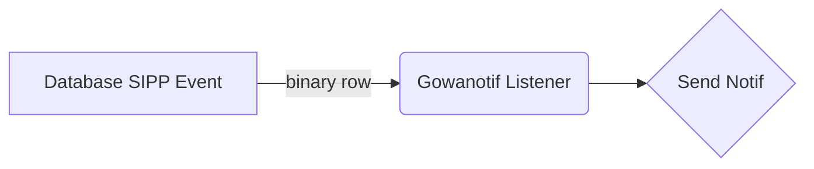

# Gowanotif

Automasi Notifikasi dan Chat Informasi berbasis whatsapp menggunakan golang dengan libarary [tulir/whatsmeow](http://handlebarsjs.com/). Di intergrasikan dengan mysql binary logging.

Berikut flow chart proses kerja automasi gowanotif :



## Installation

1. Enable mysql/mariadb binary logging menggunakan contoh configurasi pada file **mysql.cnf.example**
2. Input nomor para pegawai aktif pada kolom keterangan di masing-masing table (**jurusita,panitera_pnp,hakim_pn**) atau edit melalui menu referensi di aplikasi SIPP. Pastikan format nomor telepon menggunakan kode negara (**6285XXXXXXXX**).
3. Clone repo ini. Build, lalu sesuaikan configurasi pada .env

```

```
